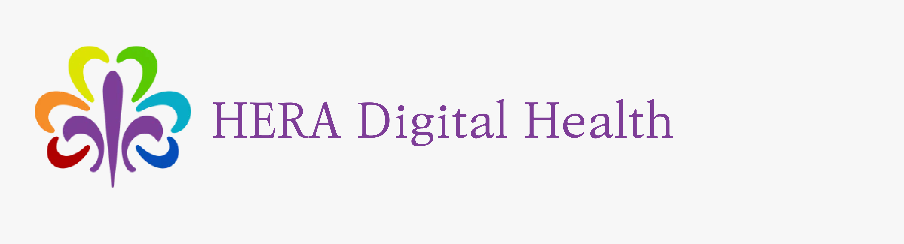

# Welcome

Welcome! (Hoş geldin! !مرحباً )

HERA (_Health Records App_) is an open-source mobile health (mHealth) platform designed to improve access to preventive health services for pregnant women and increase immunization rates among children under two, particularly in refugee communities worldwide.

## Our Mission

At HERA, we aim to bridge the healthcare gap for refugee populations by connecting them with essential healthcare services through a user-friendly mobile platform.

Thanks for stopping by! Here’s how to get started:

## Getting Started

HERA is an open-source project, and we’re excited to invite you to contribute! We have two main repositories open for contributions:

- **HERA Mobile App**: Built with **React Native**, this app provides a streamlined, intuitive interface for users seeking healthcare resources.

- **HERA Backend**: The backend is developed in **Python** and includes both the HERA’s Admin Panel and core web services to support data flow and manage healthcare resources effectively.

_Whether you’re a mobile developer, a backend specialist, or an enthusiast eager to learn, your skills are welcome here!_

## Meet the Team

- [Su Yuen](https://github.com/suyuen)
- [Husam](https://github.com/husam79)

## Join Us on Social Media

Stay updated and join our community on social media:

- [Facebook](https://www.facebook.com/HeraDigitalHealth)
- [Twitter](https://twitter.com/HERA_dHealth)
- [Instagram](https://www.instagram.com/heradigitalhealth/)
- [YouTube](https://www.youtube.com/channel/UCkQ1ovuIV8qg7lezNgc6w2w)

## Contribute Your Ideas
Have an idea or feature request? Open an issue on GitHub, or contribute to existing ones. Our project is collaborative, and we’re here to support you along the way.

**Welcome Again!** We hope to see you around.
